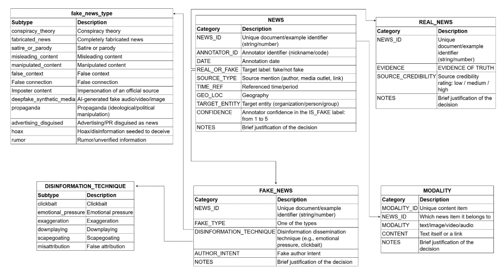

# A Bilingual Kazakh-Russian News Veracity Corpus

This repository contains a bilingual Kazakh-Russian news veracity corpus exported from Label Studio. :contentReference[oaicite:0]{index=0}  

The dataset is designed for research in automatic fake news detection, disinformation analysis, and interpretable NLP.

---

## Overview

To construct the research corpus, a multi-level annotation scheme for news texts was developed for the task of automatic detection of reliable and unreliable content. :contentReference[oaicite:1]{index=1}  

The scheme combines **document-level** and **span-level** annotation, enabling both global classification and fine-grained analysis of disinformation markers.

---

## Annotation Structure

### Document-Level Annotation

Each text is annotated with:

- `SOURCE_TYPE` — source type  
- `TIME_REF` — temporal reference  
- `GEO_LOC` — geographic location  
- `TARGET_ENTITY` — target entity  
- `doc_label` — `real` / `fake`  
- `confidence` — annotator confidence score  
- `notes` — justification  

---

### Fake-Specific Annotation

For texts labeled as `fake`, additional labels are provided:

- `fake_news_type` (multi-label):
  - conspiracy_theory
  - fabricated_news
  - misleading_content
  - propaganda
  - hoax
  - rumor
  - etc.

---

### Author Intent

Fake news texts are additionally annotated with:

- `author_intent`:
  - fear
  - distrust
  - anger
  - agenda_promotion
  - engagement

---

### Span-Level Annotation

Span-level annotation captures local markers of disinformation.

Marker groups include:

- `clickbait`
- `emotional_pressure`
- `exaggeration`
- `downplaying`
- `scapegoating`
- `misattribution`

Each group is represented by fine-grained Level 2 subtypes.

---

## Key Design Principle

Higher-level disinformation techniques are reconstructed automatically from span-level annotations rather than manually assigned.

This improves:
- consistency  
- interpretability  
- suitability for NLP tasks  

---

## Dataset Format

- Format: JSON  
- File: `data/corpus_labelstudio_export.json`  
- Source: Label Studio export  

---

## Languages

- Kazakh  
- Russian  

---

## Statistics (optional — update if needed)

- Total samples: XXXX  
- Fake: XXXX  
- Real: XXXX  

---

## Purpose

The dataset is intended for:

- Fake news detection  
- NLP research  
- Explainable AI  
- Disinformation analysis  

---

## License

This dataset is licensed under the **Creative Commons Attribution 4.0 International (CC BY 4.0)**.

---

## Usage Guidelines

- The dataset is intended for research purposes.  
- Proper attribution must be provided when using the dataset.  
- Any modifications must be clearly documented.  
- Redistribution must include attribution and license reference.  

---

## Disclaimer

This dataset may contain subjective annotations and potential biases.  
The authors are not responsible for misuse or misinterpretation of the data.

---

## Dataset Schema

